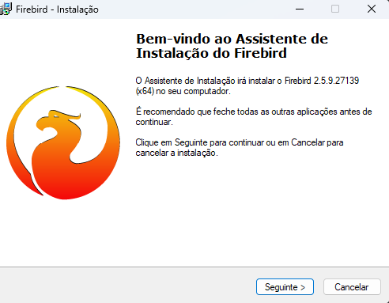
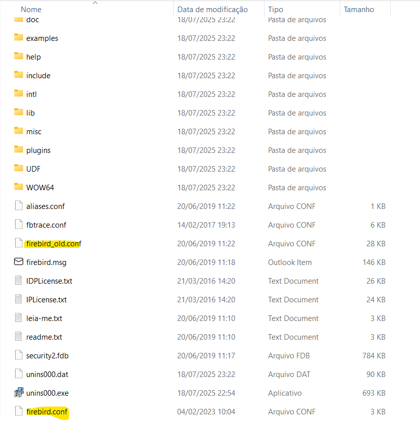

### Padrao de Diretorios
??? "📂 Fiorilli"
    ??? "📁 Arquivos"
        ??? "📁 SIA7"
            - 📦 Arquivos de instalação do SIA

    ??? "📁 Auxiliares"
        ??? "📦 Softwares auxiliares ao suporte"
            - 🧠 IBExpert
            - ☕ Java
            - 🔥 Firebird
            - 📝 Notepad++

    ??? "📁 Bancos"
        ??? "📁 SIA7"
            ??? "📁 SGB_DADOS"
                - 🗄️ SIADADOS.FDB
                - 🗄️SIAARQUIVOS.FDB

    ??? "📁 Web"
        ??? "📁 JBOSS_SIA ou PM"
            ??? "📁 jboss"
                - ⚙️ Arquivos do JBoss

---

## Instalacao Firebird
??? "🛠️ Instalação Firebird 2.5.9"
    **Passos:**
    ??? "1. Realize o download do Firebird" 
        > O link para download está na seção de links úteis  
        > Siga o padrão dos diretórios e salve-o na pasta auxiliares
    

    ??? "2. Descompacte o arquivo" 
        > Após descompactar, você verá os arquivos em sua pasta 
        >
        >Escolha a arquitetura correta do servidor (32 ou 64 bits)
        >
        > Clique no executavel
        
        
       
    ??? "3. Siga a instalcacao"
        
        > Clique em OK
        ---
        
        > Clique em Seguinte
        ---
          
        > Aceite os termos e clique em seguinte 
        ---
         
        > Clique em Seguinte
        ---
        
        > Renomeie a pasta onde o firebirde sera instalado padrao adotado Firebird_versao_nomeSistema_Porta
        >
        >Exemplo: Firebird_2_5_SIA_3055
        ---
        
        > Selecione a opcao Binarios Classic Server depois clique em seguinte
        ---
        
        > Clique em seguinte
        ---
        
        > Marque as opcoes conforme a imagem
        ---
        
        > Clique em instalar
        ---
        
        > Clique em seguinte
        ---
        
        > Desmarque as opcoes e clique em concluir
    ??? "4. Volte a pasta onde o arquivo foi descompactado"
        > De acordo com a quantidade de memoria RAM selecione um arquivo de configuracao
        >
        > Neste exemplo iremos considerar um servidor de 32GB de RAM , desta forma iremos copiar o arquivo com a capacidade de recurso correspondente.
    ??? "5. Nevegue ate a pasta onde o Firebird foi instalado"
        > Neste caso navegue ate: C:\Program Files\Firebird\Firebird_2_5_SIA_3055
        >
        > Cole o arquivo no diretorio
        
        >
        > Encontre o arquivo firebir.conf e renomeeo para firebird_old.conf e renomeie o arquivo firebird_2.5.9_SuperClassic_64bits_32GB.conf para firebird.conf
        >
        >
        
    ??? "6. Definindo porta de conexao no arquivo"
        > Utilize um editor de texto e abra o arquivo renomeado para firebird.conf
        >
        >Faca uma pesquisa no arquivo no Windows utilize as teclas CTRL + F e digite RemoteServicePort
        >
        > A porta padrao do Firebird e a 3050, porem como definimos na criacao da pasta como 3055 basta alterar o campo para 3055 e salvar o arquivo
        >
        

    ??? "7. Instalando o servico"
        > Agora abra com cmd 
        >
        > Utilize o comando cd para navegar ate o diretorio de instalacao do Firebird e acesse a pasta bin
        >
        > No nosso caso: C:\Program Files\Firebird\Firebird_2_5_SIA_3055\bin
        >
        
        >
        > Digite o seginte comando instsvc i -m -a -n Firebird_2_5_SIA_3055
        >
        > instsvc i -m -a -n é o comando para criar a instancia do serviço do Firebird. 
        >
        > Firebird_2_5_SIA_3055 é o nome da instancia do serviço do Firebird.
        >
        > Note que o nome do service e o mesmo nome que demos a pasta de instalacao do Firebird
        >
        > Agora temos o servico instalado 
        
---

## Instalacao do SIA
??? "🛠️ Instalacao do SIA7.5"
    **Passos:**
    ??? "1. Acessando o diretorio"
        > Navegue ate o diretorio padrao da instalacao 
        >
        > Fiorilli/Arquivos/SIA7